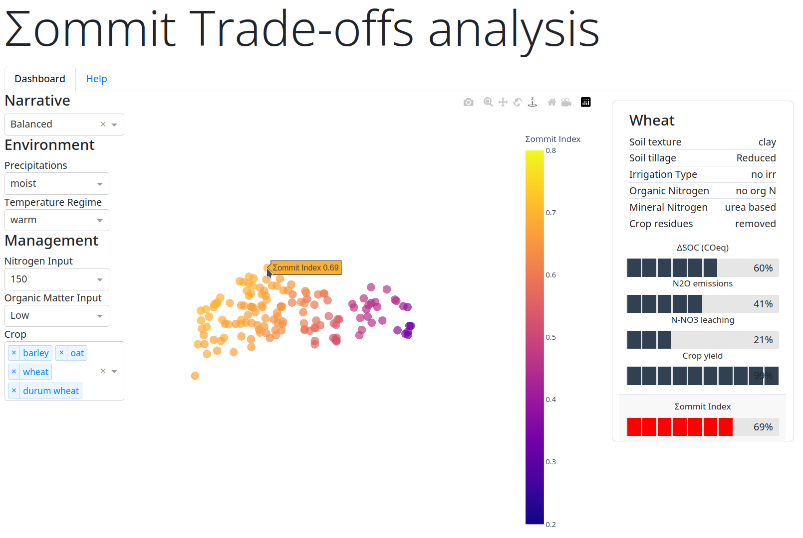

# Σommit Trade-offs analysis dashboard

⚠️⚠️⚠️ This software is in active development. Expect bugs and changes.
⚠️⚠️⚠️

## Introduction

The Σommit Trade-offs analysis dashboard is a web-based user interface
(UI) for exploring the dataset released in: Calone, R., Fiore, A.,
Pellis, G., Mongiano, G., & Bregaglio, S. (2023). Dataset of agronomic
case-scenarios and workflow to compute the Σommit index (0.1). Zenodo.
<https://doi.org/10.5281/zenodo.10014452>



The dataset was generated taking into account over two milions agronomic
case-scenarios relative to the Italian agricultural land and following
IPCC Guidelines for National Greenhouse Gas Inventories - Tier 1 ([2019
Refinement to the 2006 IPCC Guidelines for National Greenhouse Gas
Inventories Volume 4 Agriculture, Forestry and Other Land
Use](https://www.ipcc-nggip.iges.or.jp/public/2019rf/vol4.html)) to
calculate four trade-off components (i.e. soil organic carbon change,
nitrous oxide emissions, nitrate nitrogen leaching, and crop yield)
resulting from the interaction of varying management practices under
different environmental conditions. A fuzzy logic based methodology was
then used to derive the Σommit Index, which can be helpful in performing
a cost-benefit analysis considering with respect to the trade-off
components and based on a set of pre-defined arbitrary rules. In the
implementation of the methodology that produced the dataset that can be
explored with the present dashboard, four different sets of rules have
been applied, corresponding to four different narratives, namely:
balanced weighting scheme, young farmer, agrochemical company, EU
Community Agricultural Policy agency.

More details on the rules and data analysis will be found on the main
paper \"Calone, R., Fiore, A., Pellis, G., Mongiano, G., & Bregaglio, S.
A fuzzy logic evaluation of synergies and trade-offs between
agricultural production and climate change mitigation\" (currently
submitted to *Journal of Cleaner Production*).

## Installation

### Pre-requisites

You will need **Docker** and **Docker Compose** installed. Please refer
to official install instructions for your system on the [Docker
website](https://docs.docker.com/engine/install/). You\'ll optionally
need Git installed if you want to download the dashboard through git;
you can also download this repository via the GitHub interface

### Windows

1.  [Download this
    repository](https://github.com/kofm/sommit-dashboard/archive/refs/heads/main.zip).
    Alternatively you can clone the repository via PowerShell using the
    command
    `git clone https://github.com/kofm/sommit-dashboard`{.verbatim}; if
    that\'s the case, skip to step 3.
2.  Extract the ZIP file in a directory of your liking.
3.  Inside the downloaded directory you will find a PowerShell script
    named `StartΣommitDashboard.ps1`{.verbatim}. Execute it by double
    clicking it.
4.  Wait for the installation to complete (it may take a few minutes).
    Then the dashboard can be reached using you favourite browser
    (Firefox, Edge, Chrome, ecc.) at the following URL
    <http://localhost:5001>

### Unix-like systems (MacOS, Linux, etc.)

On Unix-like systems, open your favourite terminal then issue the
following commands (assuming that you\'ve git installed):

``` shell
git clone https://github.com/kofm/sommit-dashboard
cd sommit-dashboard
docker-compose up -d
```

That\'s it! Wait for the docker container to be built, then you can
reach the container at the following URL <http://localhost:5001>

## How to use the dashboard

### Comparative visualisation of multidimensional EMT distances between cases

This dashboard present a 3D scatterplot visualization showcasing what we
can simply call CEMG distances, synthesising four different aspects of
agronomic case-scenarios: Environment (E), Management (M), and Trade-off
components (T)

### How to interact with the dashboard

That\'s becasue some combinations do not exist.

### Filters

1.  Narrative

2.  Environment

### Interacting with the plot

1.  Plot controls

### How to interpret the visualization

-   Points: Each point corresponds to a unique agronomic case-scenario
    defined by crop, environment, management, and GHG fluxes, and the
    Σommit index.
-   Distance between points: A greater distance between points indicates
    higher variability or difference in the considered variables.
-   Colour coding: Points are colour-coded based on their rating
    provided by the Σommit index, allowing for quick comparative
    analysis.

This visualisation is designed as visual comparison tool of the
considered cases based on the calculated EMT distances. For details on
how the hyperplane was constructed and distances calculated see the
methods section below. Viewers can quickly discern the degree of
similarity between cases by observing their relative position on the
scatterplot. This visualisation benefits non-experts, providing a visual
aid to understand the variability in Environment, Management, and
Trade-off components without delving into complex details.

It enables viewers to intuitively understand and evaluate the
differences in EMT distances between the various cases studied. The
colour-coded points facilitate a quick and easy comparative analysis
allowing viewers to infer the relative differences in the Σommit Index.
Hovering a point with the mouse reveals more detailed data about the
point in the right side panel.

Focusing on the relative distances between the points allows to
understand the differences in the combined variables. Use the colour
coding as a quick reference to compare the ratings provided by the
Σommit index. Remember that this visualisation is a high-level
representation, and detailed analysis may require a deeper look into the
individual variables and cases.

## Methods

### Variables used

### Multiple Factor Analysis

-   What is a MFA?
-   Grouping of variables

``` ess-r
mfa <- MFA(
  sommit_data,
  group = c(4, 1, 5, 8),
  type = c("s", "s", "n", "n"),
  name.group = c("toc", "si", "env", "mgmt"),
  graph = FALSE
)
```
