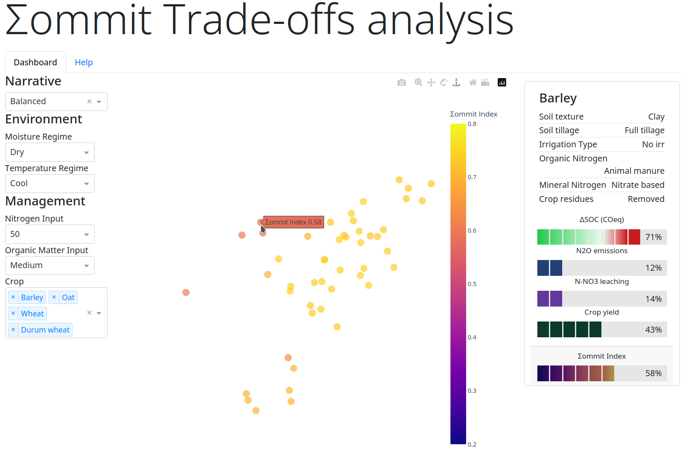

- [Σommit Trade-offs analysis dashboard](#org03ec418)
  - [Introduction](#org4166530)
  - [Screenshots](#org5662da9)
  - [Installation](#orge37198f)
    - [Pre-requisites](#org087c01b)
    - [Windows](#org545135a)
    - [Unix-like systems (MacOS, Linux, etc.)](#orgadfbe07)
  - [How to use the dashboard](#orgc8d67b1)
    - [Comparative visualisation of multi-dimensional EMT distances between agronomic case-scenarios](#org6b08812)
    - [How to interact with the dashboard](#orgfb998da)
    - [How to interpret the visualization](#orgc82106a)
  - [Methodology](#orgdc0acae)
    - [Multiple Factor Analysis (MFA)](#orgd480ed9)
    - [MFA implementation](#org8581610)
  - [Licensing](#org7923eba)


<a id="org03ec418"></a>

# Σommit Trade-offs analysis dashboard


<a id="org4166530"></a>

## Introduction

The Σommit Trade-offs analysis dashboard is a web-based user interface (UI) for exploring the dataset released in: Calone, R., Fiore, A., Pellis, G., Mongiano, G., & Bregaglio, S. (2023). Dataset of agronomic case-scenarios and workflow to compute the Σommit index (0.1). Zenodo. <https://doi.org/10.5281/zenodo.10014452>

The dataset was generated taking into account over two milions agronomic case-scenarios relative to the Italian agricultural land and following IPCC Guidelines for National Greenhouse Gas Inventories - Tier 1 ([2019 Refinement to the 2006 IPCC Guidelines for National Greenhouse Gas Inventories Volume 4 Agriculture, Forestry and Other Land Use](https://www.ipcc-nggip.iges.or.jp/public/2019rf/vol4.html)) to calculate four trade-off components (i.e. soil organic carbon change, nitrous oxide emissions, nitrate nitrogen leaching, and crop yield) resulting from the interaction of varying management practices under different environmental conditions. A fuzzy logic based methodology was then used to derive the Σommit Index, which can be helpful in performing a cost-benefit analysis considering with respect to the trade-off components and based on a set of pre-defined arbitrary rules. In the implementation of the methodology that produced the dataset that can be explored with the present dashboard, four different sets of rules have been applied, corresponding to four different narratives, namely: balanced weighting scheme, young farmer, agrochemical company, EU Community Agricultural Policy agency.

More details on the rules and data analysis will be found on the main paper "Calone, R., Fiore, A., Pellis, G., Mongiano, G., & Bregaglio, S. A fuzzy logic evaluation of synergies and trade-offs between agricultural production and climate change mitigation" (currently submitted to *Journal of Cleaner Production*).


<a id="org5662da9"></a>

## Screenshots




<a id="orge37198f"></a>

## Installation


<a id="org087c01b"></a>

### Pre-requisites

You will need **Docker** and **Docker Compose** installed. Please refer to official install instructions for your system on the [Docker website](https://docs.docker.com/engine/install/). You'll optionally need Git installed if you want to download the dashboard through git; you can also download this repository via the GitHub interface


<a id="org545135a"></a>

### Windows

1.  [Download this repository](https://github.com/kofm/sommit-dashboard/archive/refs/heads/main.zip). Alternatively you can clone the repository via PowerShell using the command `git clone https://github.com/kofm/sommit-dashboard`; if that's the case, skip to step 3.
2.  Extract the ZIP file in a directory of your liking.
3.  Inside the downloaded (or cloned) directory you will find a PowerShell script named `StartSommitDashboard.ps1`. Execute it by double clicking it.
4.  Wait for the container to build and start (it may take a few minutes). Then
5.  The dashboard can be reached using you favourite browser (Firefox, Edge, Chrome, ecc.) at the following URL <http://localhost:5001>.


<a id="orgadfbe07"></a>

### Unix-like systems (MacOS, Linux, etc.)

On Unix-like systems, open your favourite terminal then issue the following commands (assuming that you've git installed):

```shell
git clone https://github.com/kofm/sommit-dashboard
cd sommit-dashboard
docker-compose up -d # or `docker compose up -d` if your using Compose v2 
```

That's it! Wait for the docker container to be built, then you can reach the container at <http://localhost:5001>


<a id="orgc8d67b1"></a>

## How to use the dashboard


<a id="org6b08812"></a>

### Comparative visualisation of multi-dimensional EMT distances between agronomic case-scenarios

This dashboard present a 3D scatterplot visualization showcasing what we can simply call EMT distances, synthesising three different aspects of agronomic case-scenarios:

-   Environment (E)
-   Management (M)
-   Trade-off components (T)


<a id="orgfb998da"></a>

### How to interact with the dashboard

1.  Filters

    The filters in the app allow you to tailor the displayed data according to specific criteria, ensuring that you can focus on the most relevant agronomic case-scenarios for your needs. However, it’s important to note that certain combinations of filters might lead to a situation where there are no matching case-scenarios, resulting in an empty plot. If this happens, try to adjust your filter selections to broaden the search and populate the plot with relevant data points.
    
    1.  Narrative
    
        In the Σommit Trade-offs analysis dashboard, the narratives played a crucial role in shaping the results, particularly how the Σommit index was calculated. The Σommit index is a numerical value derived from four components of agricultural trade-offs, and the weights assigned to these components have been adjusted to reflect different priorities and perspectives. This is where the narratives come in.
        
        -   N1 – Young Farmers: This narrative reflects the viewpoint of innovative young farmers eager to balance productivity with sustainable practices. When you choose this narrative, the weights are adjusted to highlight aspects of agricultural trade-offs that are most relevant to this group. This might mean, for example, giving more importance to sustainable soil management or the land's long-term health.
        -   N2 – Agrochem Corporation: From the perspective of a multinational agricultural chemical company, the focus might be more on maximizing crop yield. Selecting this narrative adjusts the weights in the Σommit index calculation to emphasize these aspects, helping to highlight scenarios where agrochemical products are likely to be most effective.
        -   N3 – CAP Paying Agency: The priorities could be different again for an EU national agency responsible for allocating agricultural funds. This narrative adjusts the Σommit index calculation to reflect a policy and funding allocation standpoint, perhaps giving more weight to practices that align with EU agricultural policies.
        
        Additionally, a "Balanced" narrative is available, which assigns equal weights to all components, providing a neutral and unbiased view of the data. This can be particularly useful if you are looking for a broad overview without the influence of any specific stakeholder’s perspective.
        
        These narratives were carefully developed based on expert input through surveys with specialists in greenhouse gas emissions and soil carbon-nitrogen dynamics. By adjusting the weights used in the Σommit index calculation, each narrative provides a unique lens to view and understand the trade-offs associated with different agricultural scenarios. Even if you're not an expert in the field, the dashboard is designed to be accessible and informative. Feel free to switch between narratives and explore how the change in perspective influences the displayed results, providing a richer understanding of the agricultural trade-offs presented.
    
    2.  Environment
    
        The "Environment" filters are designed to help you adjust the displayed data to match specific climate and precipitation conditions.
        
        -   Temperature Regime
            -   **Cool**. Areas with cooler average temperatures.
            -   **Warm**. Appropriate for regions with warmer average temperatures.
        
        -   Moisture Regime:
            -   **Dry**. This setting is for areas with less frequent precipitation, leading to drier soil conditions.
            -   **Moist**. Choose this option for areas with more frequent precipitation, resulting in more humid soil conditions.
    
    3.  Management
    
        The "Management" filters allow you to select a subset of the data specific to agricultural practices and types of crops.
        
        -   **Nitrogen Input** (kg ha-1): choose the amount of nitrogen added to the soil, ranging from 0 to 200 kg per hectare. This helps to reflect different fertilization practices.
        
        -   Organic Matter (OM) Input:
            -   **Low**. A minimal addition of organic material to the soil.
            -   **Medium**. A moderate addition of organic material to the soil.
            -   **High**. A substantial addition of organic material to the soil.
            -   **High with Manure**. A substantial addition of organic material to the soil, supplemented with manure.
        
        -   Crops: select from a variety of crops such as cereals, legumes, and vegetables.

2.  Interacting with the plot

    Engaging with the 3D plot in the dashboard is intuitive, and here are the various ways you can interact with it to get the most out of your experience:
    
    -   ****Rotating the Plot****: Click and hold the left mouse button while dragging over the plot to rotate and view it from different angles.
    -   ****Zooming In and Out****: Use the scroll wheel on your mouse to zoom in for a closer look, or zoom out to see the broader perspective.
    -   ****Resetting the View****: If you want to return to the original view of the plot, click on the home icon located in the top left corner of the plot area.
    -   ****Viewing Data Points****: Hover your mouse over any point on the plot to see a popup that displays the index and a detailed breakdown of the agronomic case-scenario. This includes specifics on management and environmental factors, as well as the values of the trade-off components.
    -   ****Additional Controls****: Look for the toolbar in the top right corner of the plot area. Here, you'll find tools for panning, zooming, and adjusting the rotation style between orbital and turntable. There's also an option to take a screenshot of the current view of the plot, allowing you to save it for future reference or share with others.


<a id="orgc82106a"></a>

### How to interpret the visualization

-   Points: Each point corresponds to a unique agronomic case-scenario defined by crop, environment, management, and GHG fluxes, and the Σommit index.
-   Distance between points: A greater distance between points indicates higher variability or difference in the considered variables.
-   Colour coding: Points are colour-coded based on their rating provided by the Σommit index, allowing for quick comparative analysis.

This visualisation is designed as visual comparison tool of the considered cases based on the calculated EMT distances. For details on how the hyperplane was constructed and distances calculated see the methods section below. Viewers can quickly discern the degree of similarity between cases by observing their relative position on the scatterplot. This visualisation benefits non-experts, providing a visual aid to understand the variability in Environment, Management, and Trade-off components without delving into complex details.

It enables viewers to intuitively understand and evaluate the differences in EMT distances between the various cases studied. The colour-coded points facilitate a quick and easy comparative analysis allowing viewers to infer the relative differences in the Σommit Index. Hovering a point with the mouse reveals more detailed data about the point in the right side panel.

Focusing on the relative distances between the points allows to understand the differences in the combined variables. Use the colour coding as a quick reference to compare the ratings provided by the Σommit index. Remember that this visualisation is a high-level representation, and detailed analysis may require a deeper look into the individual variables and cases.


<a id="orgdc0acae"></a>

## Methodology


<a id="orgd480ed9"></a>

### Multiple Factor Analysis (MFA)

Multiple Factor Analysis (MFA) is a statistical method used to analyze and visualize data that come from several groups of variables. In the context of this dashboard, these groups of variables are related to different aspects of agronomic case-scenarios, such as environmental conditions, management practices, and outcomes.

Here's a simplified explanation of some MFA features to help you understand how it works:

1.  ****Combining Different Data Types****: MFA allows us to combine different types of data (e.g., categorical, numerical) and treat them simultaneously, which is crucial for holistic analysis.
2.  ****Balancing the Influence****: Each group of variables is normalized to ensure that no single group dominates the analysis due to its size or variability, ensuring a balanced representation of all aspects.
3.  ****Visualizing Relationships****: The results of the MFA are visualized in a plot, where each point represents a specific agronomic case-scenario. The proximity of points on the plot indicates how similar they are in terms of the variables considered.

MFA helps us to synthesize and visualize complex and numerous data, revealing underlying patterns and relationships that might not be apparent when looking at the variables separately.


<a id="org8581610"></a>

### MFA implementation

For statistics nerds (🤓), the following is the actual R code that generated the MFA on which the dashboard relies, using the [FactoMineR](http://factominer.free.fr/factomethods/multiple-factor-analysis.html) R package.

```R
mfa <- FactoMineR::MFA(
  sommit_data,
  group = c(4, 1, 5, 8),
  type = c("s", "s", "n", "n"),
  name.group = c("toc", "si", "env", "mgmt"),
  graph = FALSE
)
```


<a id="org7923eba"></a>

## Licensing

The software in this repository is licensed under the Apache License 2.0. You can find the terms in the `/app/LICENSE` file.

The data provided in this repository is licensed under the Creative Commons Attribution-ShareAlike (CC-BY-SA). The terms for this license can be found in the `/data/LICENSE` file.